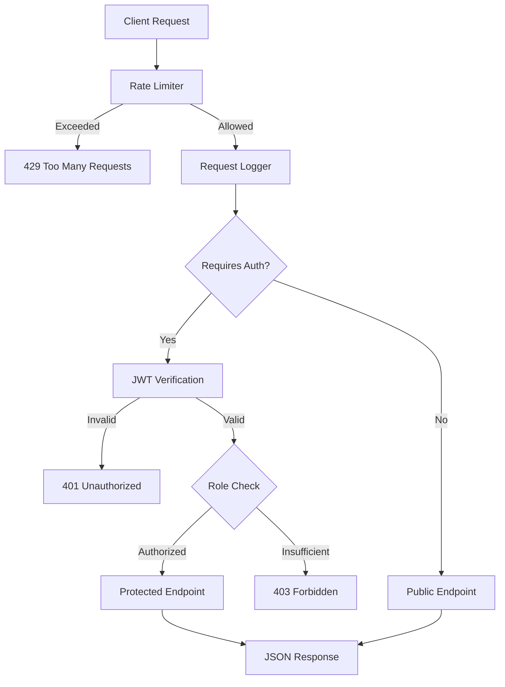

# API Gateway Lite

A lightweight API gateway built with Node.js and Express that handles authentication, rate limiting, and role based access control out of the box. Designed as a boilerplate for backend developers who need a quick and secure API setup without the complexity of full scale gateway solutions.

## Features

- JWT based authentication with token expiry
- Rate limiting to prevent abuse (100 requests per 15 minutes per IP)
- Role based access control (admin and user roles)
- Request logging with in memory storage
- Admin dashboard endpoints for viewing logs and traffic stats
- Health check endpoint for monitoring
- Clean error handling with helpful messages
- CORS enabled for frontend integration

## How It Works



## Getting Started

### Prerequisites

- Node.js 18 or higher
- npm

### Installation

```bash
git clone https://github.com/Darkshaz/api-gateway-lite.git
cd api-gateway-lite
npm install
npm start
```

The server will start on `http://localhost:3000`

## Usage

### Step 1: Check the Gateway Status

```bash
curl http://localhost:3000/
```

### Step 2: Login to Get a Token

```bash
curl -X POST http://localhost:3000/auth/login \
  -H "Content-Type: application/json" \
  -d '{"username": "admin", "password": "admin123"}'
```

This returns a JWT token that is valid for 1 hour.

### Step 3: Access Protected Endpoints

```bash
curl http://localhost:3000/api/profile \
  -H "Authorization: Bearer YOUR_TOKEN_HERE"
```

### Step 4: Admin Only Endpoints

```bash
curl http://localhost:3000/admin/logs \
  -H "Authorization: Bearer YOUR_ADMIN_TOKEN"
```

## API Endpoints

| Method | Endpoint | Auth | Role | Description |
|--------|----------|------|------|-------------|
| GET | `/` | No | Any | Gateway info and available endpoints |
| GET | `/health` | No | Any | Health check with uptime |
| POST | `/auth/login` | No | Any | Login and receive JWT token |
| GET | `/api/profile` | Yes | Any | View your profile data |
| GET | `/api/data` | Yes | Any | Access protected sample data |
| GET | `/admin/logs` | Yes | Admin | View recent request logs |
| GET | `/admin/stats` | Yes | Admin | View traffic statistics |

## Test Accounts

| Username | Password | Role |
|----------|----------|------|
| admin | admin123 | admin |
| user | user123 | user |

## Environment Variables

| Variable | Default | Description |
|----------|---------|-------------|
| PORT | 3000 | Server port |
| JWT_SECRET | (built in) | Secret key for signing tokens |

## Tech Stack

- **Runtime:** Node.js
- **Framework:** Express
- **Auth:** JSON Web Tokens (jsonwebtoken)
- **Security:** express-rate-limit, CORS

## License

MIT License
